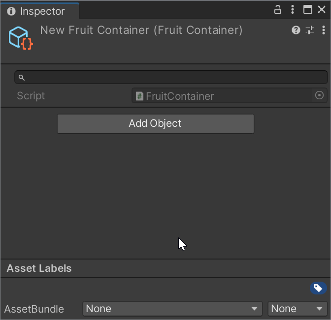
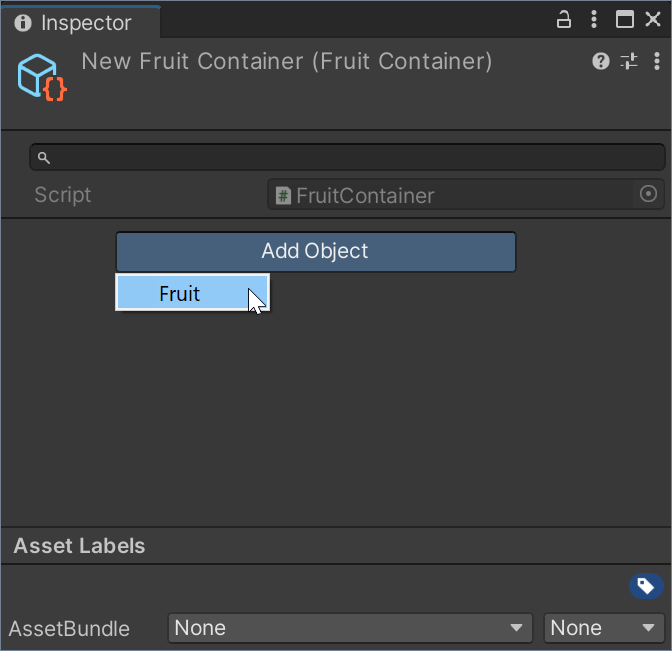
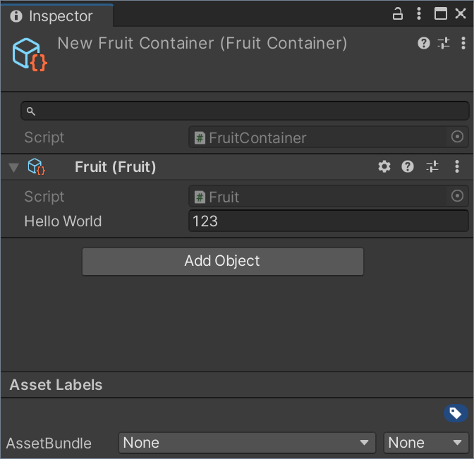

# ScriptableObject Container for Unity

The [ScriptableObject](https://docs.unity3d.com/Manual/class-ScriptableObject.html) type in Unity is a powerful concept with many different applications.
However, it lacks a feature that would greatly increase its usefulness for me: the ability to add "Components" to it.
While Unity allows you to add "Components" to a ScriptableObject asset through code, it does not provide functionality to do so through the Inspector.

The ScriptableObject Container package aims to solve this issue.
It allows you to work with ScriptableObjects in a similar manner to how you work with Components and GameObjects.

To add a ScriptableObject to a ```ScriptableObjectContainer```, you can use the Inspector, just like adding a Component to a GameObject.

On the scripting side, you can access the ScriptableObject from the ```ScriptableObjectContainer``` in a similar way to how you access a Component from a GameObject.

| ScriptableObjectContainer  |     GameObject      |
|----------|---------------|
| ```ScriptableObject GetObject(Type type)``` | ```Component GetComponent(Type type)``` |
| ```void GetObjects(Type type, List<T> results)``` | ```void GetComponents(Type type, List<T> results)``` |
| ```T GetObject<T>()``` | ```T GetComponent<T>``` |
| ```void GetObjects<T>(List<T> results)``` | ```void GetComponents(List<T> results)``` |

You can think of a ScriptableObjectContainer as "GameObject" and its sub-assets (or objects) would be the Components on a GameObject.

# Installation

From the Unity main menu choose Window > Package Manager.
In the Package Manager window, choose "Add package from git URL" and insert one of the Package URL's you can find below.

## Package URL's

| Version  |     Link      |
|----------|---------------|
| 1.0.0-pre.1 | https://github.com/pschraut/UnityScriptableObjectContainer.git#1.0.0-pre.1 |

# Credits

If this package is useful to you, please mention my name in your credits screen.
Something like "ScriptableObject Container by Peter Schraut" or "Thanks to Peter Schraut" would be very much appreciated.

# How it works

The package introduces the type ```ScriptableObjectContainer``` that 
derives from ScriptableObject.

A custom inspector implements the magic that allows to add a ScriptableObject as sub-asset, 
to remove such sub-asset as well as to change properties of such sub-asset through the Inspector. 

The ScriptableObjectContainer Inspector attempts to mimic the look and feel of Unity's built-in 
Inspector when working with GameObjects and Components.

The ScriptableObjectContainer itself is rather light-weight. It contains an array with 
references to its sub-assets.
This allows you to retrieve these sub-assets through code, similar to how you work with the 
```GameObject.GetComponent``` and ```GameObject.GetComponents``` methods.

Beside the sub-assets array and its corresponding getter methods,
the ScriptableObjectContainer does not contain more code that's required in a build. 
It implements ```OnValidate``` to update fields in sub-assets that use the 
```SubAssetOwnerAttribute``` attribute, but this code runs in the editor only.

# Test Runner integration

The ScriptableObjectContainer package comes with several tests that run in 
[Unity's Test Runner](https://docs.unity3d.com/Packages/com.unity.test-framework@latest).

The tests can be enabled through the 
```SCRIPTABLEOBJECTCONTAINER_ENABLE_TESTS``` scripting define symbol.
Add this scripting define symbol to the Player Settings and the tests appear in
Unity's Test Runner.

Additionally to the tests in the Test Runner window,
it adds various context menu items to create test assets,
which is the reason why it's disabled by default, to avoid cluttering your project with things you most likely don't need.

# Context Menu integration

The package adds a "ScriptableObject Container" item to the
assets context menu, which allows to create a new
ScriptableObject Container asset. 

In case you don't want to allow the use of a ScriptableObject Container, 
but only allow your specific derived containers, use the 
```SCRIPTABLEOBJECTCONTAINER_DISABLE_MENUITEM```
scripting define symbol to remove the context-menuitem.

# Examples

## Code

FruitContainer.cs:
```CSharp
using UnityEngine;
using Oddworm.Framework;

// Inherit a new container type from ScriptableObjectContainer.
// The CreateAssetMenu attribute lets you create the container from the Assets/Create menu.
[CreateAssetMenu(menuName = "FruitContainer")]
public class FruitContainer : ScriptableObjectContainer
{
}
```

Fruit.cs:
```CSharp
using UnityEngine;
using Oddworm.Framework;

// Create a new type that adds itself to the "FruitContainer" Inspector.
// The CreateSubAssetMenu attribute lets you add objects to the container through in the Inspector.
[CreateSubAssetMenu(typeof(FruitContainer))]
public class Fruit : ScriptableObject
{
    [SerializeField] int m_HelloWorld = 123;
}
```

When you create the ```FruitContainer``` asset via "Assets/Create/FruitContainer" it displays an empty ScriptableObjectContainer in
a similar manner as a GameObject without Components.
 

 
You can then add sub-assets via the "Add Object" button. The menu displays all ScriptableObject that have been added to the
container via the ```CreateSubAssetMenu``` attribute.
 

 
After adding the sub-asset it's shown in the Inspector as demonstrated in the image below.
 



## CreateSubAssetMenuAttribute

A ScriptableObjectContainer shows an "Add Object" button in the Inspector,
much like a GameObject shows a "Add Component" button. It allows you to add
objects that inherit from ScriptableObject to a specific container.

In order to add a ScriptableObject to the "Add Object" menu, you need to
add the ```CreateSubAssetMenuAttribute``` to the ScriptableObject type.

You can add multiple ```CreateSubAssetMenuAttribute``` to add it to different
containers. You can also specify the base-container type to add a menu item
to all types that inherit from the base-container.
```CSharp
[CreateSubAssetMenu(typeof(FruitContainer), menuName = "Fruit")]
class Fruit : ScriptableObject
{
    // ...
}
```


## DisallowMultipleSubAssetAttribute

If you want to prevent to add the same ScriptableObject type (or subtype)
more than once to the same container, you can use the ```DisallowMultipleSubAssetAttribute```.

This works similar to how you use Unity's
 [DisallowMultipleComponentAttribute](https://docs.unity3d.com/ScriptReference/DisallowMultipleComponent.html)
to prevent a MonoBehaviour of same type (or subtype) to be added more than once to a GameObject.
```CSharp
[DisallowMultipleSubAsset]
class Fruit : ScriptableObject
{
    // ...
}
```
[](http://www.youtube.com/watch?v=QnjTcPqM0sg "")


## SubAssetOwnerAttribute

If you need a reference to the ScriptableObjectContainer inside your ScriptableObject
sub-asset, you can use the ```SubAssetOwnerAttribute``` for the system to automatically
setup the reference for you. The code that sets up references runs in the editor only,
there is no performance penalty in a build.
```CSharp
class Fruit : ScriptableObject
{
    [SubAssetOwner]
    [SerializeField] ScriptableObjectContainer m_Container;
}
```
If you know that a sub-asset lives inside a specific container type only,
you can also use the specific container type.
```CSharp
class Fruit : ScriptableObject
{
    [SubAssetOwner]
    [SerializeField] Basket m_Container; // The Basket type must inherit
                                         // from ScriptableObjectContainer
}
```
[](http://www.youtube.com/watch?v=Ex9FQ3yXhBw "")


## SubAssetToggleAttribute

Unity does not support the concept of enabling and disabling a ScriptableObject,
but I often found myselfing wanting a simple way to expose an "enabled" toggle
for whatever use-case I have.

Using the ```SubAssetToggleAttribute``` on a ```bool``` field causes the
ScriptableObjectContainer Inspector to display a toggle (checkbox) like you can find
in Components on a GameObject.
```CSharp
class Fruit : ScriptableObject
{
    [SubAssetToggle]
    [SerializeField] bool m_IsEnabled;
}
```
You can use any field name you like, it doesn't have to be ```m_IsEnabled```.
However, it's worth noting that you can't use ```m_Enabled``` as field name, because
it conflicts with a field that Unity implements too (but seemingly Unity isn't using it).

[](http://www.youtube.com/watch?v=tMfqDenY1pc "")

